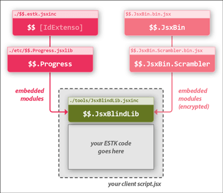

## Dev Tools

### Overview

The `/tools` subdir is not part of ***IdExtenso***'s core distribution. It offers to developers additional gems and scripts that make coding more productive.

From this location, any `.jsx` script can include the core framework using `#include '../$$.jsxinc`. As usual, extra modules—which always belong to `/etc`—may be selectively added using `#include '../etc/<ModuleName>.jsxlib`.

### List of Tools

##### [`GetMD5.jsx`](GetMD5.jsx)

Compute and prompt the MD5 hash of the input string. (Based on `etc/$$.MD5.jsxlib`.)

---

##### [`JsxBlindLib.jsxinc`](JsxBlindLib.jsxinc)

***JsxBlind 2.1 Library*** for ExtendScript Toolkit. A full, smart, and fast `jsxbin` obfuscator.

_How to use it?_ Give a look at the sample code [`UseJsxBlindLib.jsx`](../tests/UseJsxBlindLib.jsx) in the `/tests` directory.

  - Version 2.1 (4 Feb, 2019) fixes two critical bugs regarding reserved words.

**In a nutshell:**

1. The file `./tools/JsxBlindLib.jsxinc` is an “IdExtenso library”, that is, a regular _module_ which invokes `$$.load()`. Therefore you just have to `#include` that library at the beginning of your project and its API is instantly loaded and ready to use.

     #include path/to/tools/JsxBlindLib.jsxinc
	 
	 // Your ESTK code goes here, e.g:
	 var result = $$.JsxBlindLib(myBinFile, myOptions);
	 // etc

2. Alternately, if you need to keep your project independent from IdExtenso's source files, use the “includable JSXBIN image” `JsxBlindLib.bin.jsx`. It provides a fully compiled version of the library with all nested dependencies. The you can put it anywhere and use:

     #include any/path/to/JsxBlindLib.bin.jsx
	 
	 // Your ESTK code goes here, e.g:
	 var result = $$.JsxBlindLib(myBinFile, myOptions);
	 // etc

_Note._ The only difference between option 1. and option 2. is, the former still belongs to IdExtenso's directory structure and keeps up-to-date when something changes in the framework. By contrast, option 2. is detached from any change in the framework: it reflects the API at a particular time.

3. In either case, including the library makes available the root object `$$`, its core modules (`$$.JSON`, `$$.Log`, etc) and two important modules: `$$.Progress` and `$$.JsxBlindLib`.

* [`$$.Progress`](/etc/$$.Progress.jsxlib) just provides the API of a basic progress bar. It is required if you tell JsxBlind to show the progression of its process.

* [`$$.JsxBlindLib`](/tools/JsxBlindLib.jsxinc) implements the specific API of the library, which itself relies on two encrypted modules (`$$.JsxBin` and `$$.JsxBin.Scrambler`) that you don't have to worry about.

---

##### [`SelToPng.jsx`](SelToPng.jsx)

Convert the current selection (`PageItem`, `Group` etc.) into a serialized PNG string and show the result in a dialog. You can then copy-paste the PNG string and use it to build a ScriptUI image straight in your code without the need of deploying a file.
